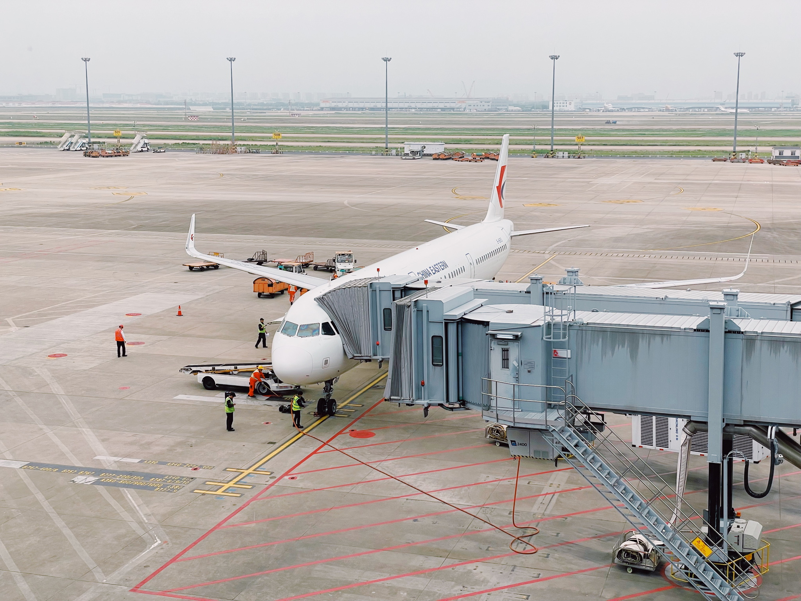
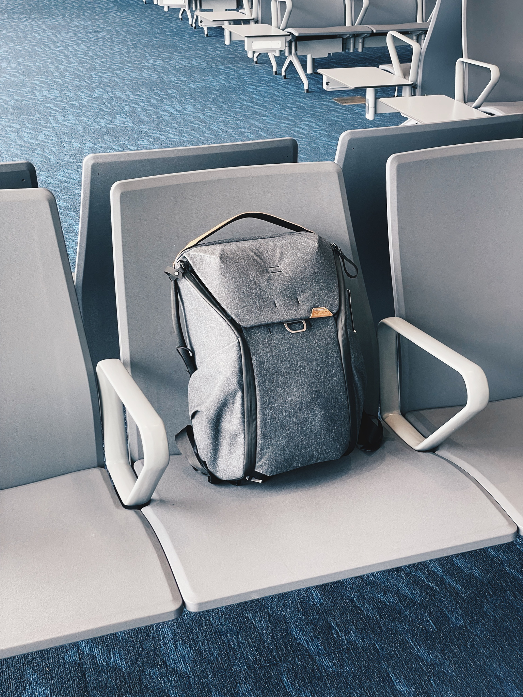
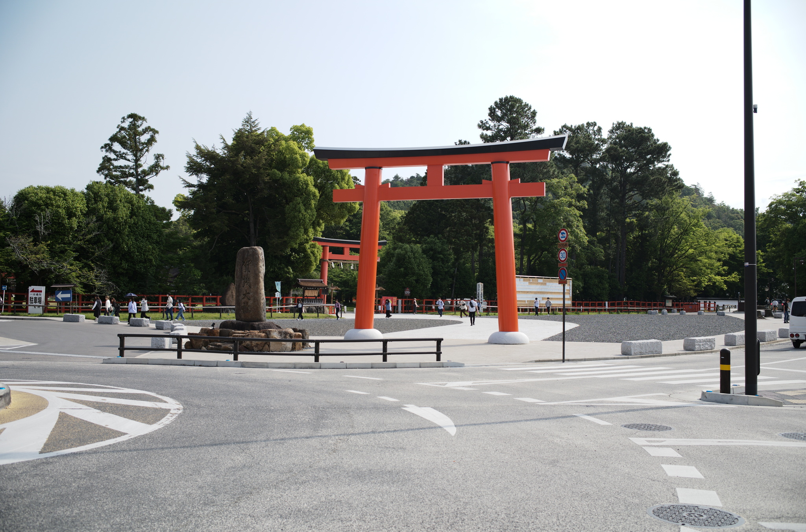
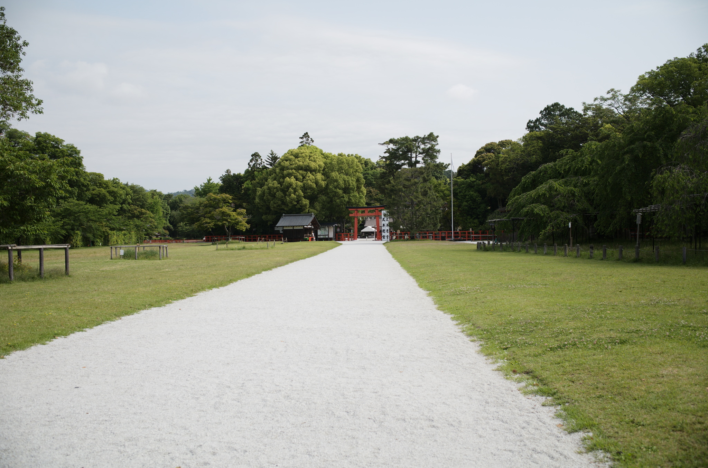
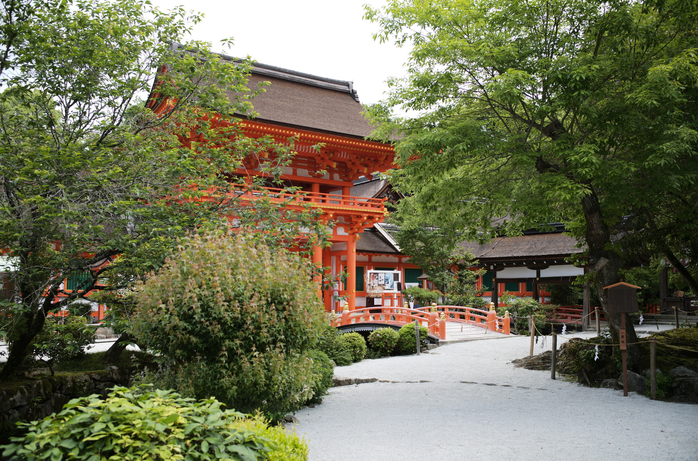
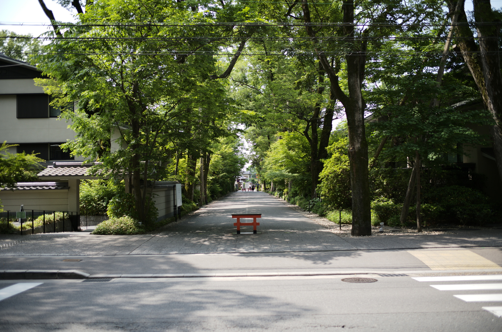
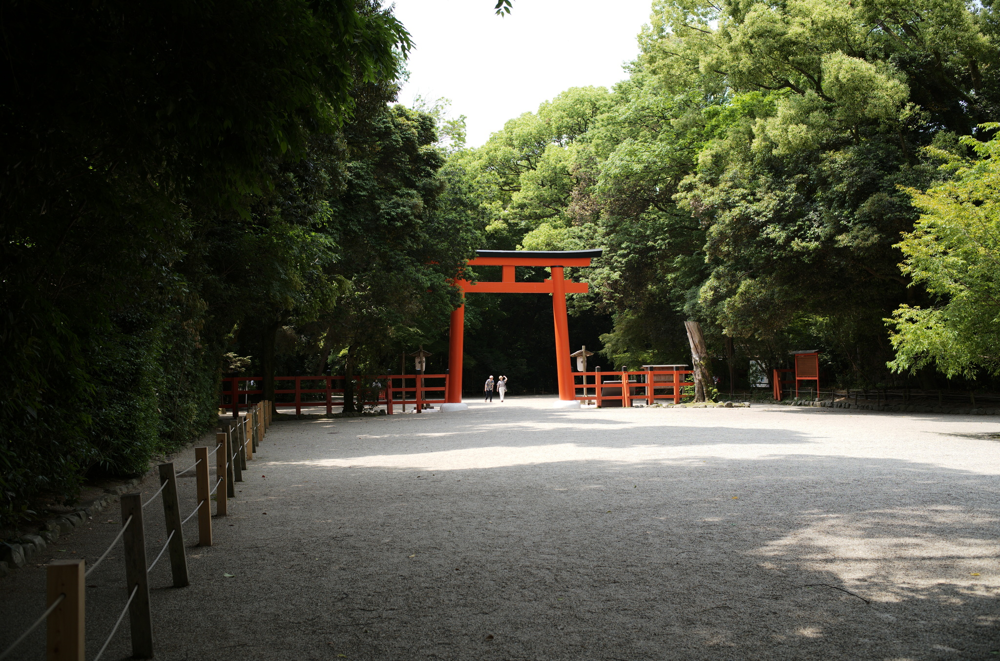
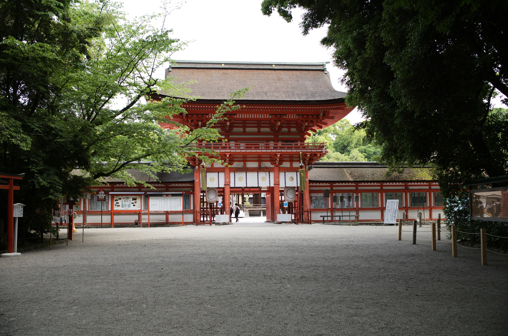

## 前言

2020 年春节其实就计划过这次旅行，但迫于 COVID-19 爆发、医院需要人手支援、外部环境不适合出行等等原因，只能取消所有机票酒店及好不容易订到的[修学院離宮](https://sankan.kunaicho.go.jp/english/index.html)参观名额。当然，当时订票的航司、Airbnb 及房东，还有宫内厅等收到我的来信（以及医师执照/工作证件/所有工作人员留院支援的证明）后非常迅速地操作了退票、退订、退款操作，这点是非常感激的。本以为和 2005 年 SARS 一样，可以在当年夏天再次出国……

没想到这么一等就等了三年，博士毕业了。

## DAY 1 ：到达京都

KIX 落地，乘坐 JR はるか 直达京都。

交通费用：3110 円（JR-WEST PASS 可覆盖）

比较奇怪的是，像 ANA 这样的日本航司居然没有剩下多少上海直飞东京的航班，多半需要转机。而且即便是转机票，也较前明显涨价，直飞更是高昂。万般无耐之下只能选了东航出行。

近期因为 COVID-19 相关限制解除，外国赴日游客激增，京都的酒店价格简直离谱。之前计划入住的酒店，疫情前查看只有 1000 人民币左右，如今高达 4000 余人民币一晚，着实高攀不起，只得上 Airbnb 预订住处。非常遗憾的是之前住过、原先计划再次入住的 apartment 没能撑过疫情，已经不能预定了，遗憾。

这次住在近铁电车站附近，在僻静的居民区里，就是找起来稍微有点吓人…

随行的摄影包方面我也吸取了以前的教训，不再选择单肩包或装载能力较差的小包。之前带着一个单肩包装着哈苏 203FE + 110/2 FE 和备用胶卷跑了一整个京都，到最后已经累得没有力气拍摄了，反而 GR 拍摄更加频繁一些。

这次换了 Peak Design Everday Backpack 20L 双肩包出行，装载了 M10R + 11663 + 11891 的组合。从背负感、内部整理能力和配件的设计用心程度来讲，这个包卖得好确实有他的道理。除了可以放足够多的相机机身及镜头外还能塞进大量其他所需物品（护照包、充电宝、备用电池、毛巾等），非常满意。

## DAY 2：京都市内

[ **京都駅 → 上贺茂神社 → 下鴨神社 → 北野天満宮 → 大德寺** ]

交通费用：700 円，京都市営バス 1 日券（即：京都市营巴士一日券）

当天主要在市内活动，这些据国内旅行社的工作人员说，都是属于冷门景点来着 😂

京都的交通手段和东京还是不同，主要是市营巴士，而购买该券即可以 700 円的价格爽坐巴士一整天进行游览。不过该券将在 [2023 年 9 月以后不再发售](https://www.city.kyoto.lg.jp/kotsu/page/0000028337.html) ，保留 1,100 円的 [地下鉄・バス 1 日券](https://oneday-pass.kyoto/) （变相涨价）。

### 賀茂別雷神社（上贺茂神社）

从京都站出发，大约 1 小时左右到达上贺茂神社。周边僻静，而且由于我们到达较早，神社的工作人员也还没有上班。可以安安静静地观看建筑和神苑构成。

### 賀茂御祖神社（下鸭神社）

其实上贺茂神社和下贺茂神社都是京都的最古老也是最重要神社之一。根据 Wiki 和神社内资料介绍，两座贺茂神社在奈良时代就开始被皇家所崇敬。明治时代开始设立的的近代社格制度里，两座神社的社格甚至只在作为日本神道教源流的伊势神宫之下。而且在楼门前，两座神社都有树起 5 块牌子，表明每次式年迁宫都有天皇及亲王家下赐的物料及费用等，走过京都众多神社之后再也没有见过其它神社有如此待遇，可见它们的重要性。

两座神社的

## DAY 3：京都 - 伊势神宫

当日交通为近鉄（近畿日本鉄道），JR-WEST PASS 不可覆盖。

西日本 JR 推出了很多类型的周游券（JR-WEST PASS），但就算覆盖最广的一版（从最西边的九州到富山地区）也不把三重县带着一起玩。覆盖三重县的似乎也只有近鉄和 JR 東海，雪上加霜的是原有的伊势、熊野、和歌山地区周游券似乎也下线了…

不过好在，近铁也有他们自己的周游券，如果是去伊势神宫的话，更是有套票可以买（）。其中包括了到伊势市（以及更后面的贤岛等）以及返程的票，还有来回的巴士费用。我们返程的时候选择了[観光特急しまかぜ](https://www.kintetsu.co.jp/senden/shimakaze/)，所以还有额外的 1,050 円的特殊车辆费用。

此外这些套票是在近铁的人工窗口购买的，门外可以找中文翻译（虽然我会日文）。窗口的小姐姐也非常热情，听说我们要去伊势神宫，也为我们的指定席订了非常舒服的位置，要给一个大大的好评！

套票价格：7,100 円

### 京都駅 - 伊勢市

08:10 有直达特快列车始发（近鉄京都線特急）

10:13 前后到达

由于是全席指定，如果是自己购票，那推荐 2、3 号车的左侧位置。这两节车厢的位置会较后方车辆更高一些，可以看到更多风景。左侧能看到平原和城市，而右侧基本都是山，没什么可看的。此外，我比较喜欢一路上有些雨云的感觉，非常像苏杭地区的样子。

### 伊勢市 - 外宫 - 内宫

伊勢市 - 外宫：从 JR 伊勢市站步行约 7 分钟

外宫 - 内宫：51 路公交车，总共 4km 且有上坡，公交车间隔非常长而且较为拥挤。

外宫，也就是丰受大神宫，供奉的是。。。。

根据参拜指引，不能跳过外宫直接参拜内宫，所以建议两边都要去参观一下。

从内宫出来有一整条商业街，。这条商业街原先也是为远道而来的参拜者服务，歇脚、娱乐、购买纪念品、品尝土特产…等等一应俱全。由于距离松阪非常近，还有非常多售卖松阪牛肉的店家。我们午饭时选择的是（这家），而且这家店的门口会展示今日使用的和牛/松阪牛的编号，相对安心。

### 内宫 - 伊勢市

建议是在 内宮前 这站（也就是发车站）乘坐回程公交。可能会有临时增开车辆，将游客送回沿途的近铁站。大约时间在 30 分钟左右，等待公交的时间会比较长，毕竟三重县并不是一个人口密集的发达地区。

### 伊勢市 - 京都駅

回到京都只有乘坐近铁一个选择，如果是回到名古屋的话则有 JR 可以乘坐。

#### Option 1

15:07 近鉄直达特快列车

17:15 到达京都

这一方案较为平价，和来时的列车同型号，班次较多。

#### Option 2

15:34 [観光特急しまかぜ](https://www.kintetsu.co.jp/senden/shimakaze/) （全部指定席，需要提前购票）

17:33 到达京都

## DAY 4：奈良

2023/05/26

中午出发，JR 到达

奈良国立博物馆 → 奈良公园、东大寺、春日大社

唐招提寺新宝藏在反方向

## DAY 5：広島 嚴島神社

最早 06:55 出发，10:00 前后到达

[ **京都 → 新大阪（可选） → 広島 → 宮島口** ]

交通费用：预计单人单程 11,280 円，JR PASS 可覆盖（国内购买 795 元，合 15,508 JPY）

注意：这里有一个似乎连官网都没写的**大坑**，在售票机选座位时我发现不能用 JR PASS 购买从京都出发直接去广岛的指定席券，咨询站员后才知道**这张 PASS 不覆盖东京到新大阪这一段**，但当天我因为脚上有伤，新大阪换车难度较大，所以额外掏了 3000 余日元购买了京都到新大阪的乘车券+指定席券。另一方面，也可以坐はるか指定席到新大阪换新干线，这样就没有额外费用产生，返程同理。

于是我们的交通是从京都出发，坐 JR 新幹線のぞみ直达广岛。随后再坐 JR 普通列车到达宮島口，乘坐轮渡前往宮島。

不要小看瀬戸内海，尽管叫内海，可它依然是海。轮渡依然颠簸不小，空气中可以闻到盐味…而且 6 年前去的时候是夏天，紫外线极强，硬生生被晒伤蜕皮，所以一定要做好防晒措施。

夏天落日时间约 19:00 前后，末班轮船 20:00 前后。因此想要拍到日出日落，最好的办法是在岛上住一晚。不过岛上住宿预定困难，而且我们的主要活动在京都附近，因此作罢，少许有点遗憾。

嚴島神社也是 2023 年 G7 广岛峰会期间各国领导人也来参观过的神社。

## DAY 6：京都 西芳寺（苔寺）

[官方网站](http://saihoji-kokedera.com/reservation.html)

交通：京都バス(73 系統)で約 60 分「苔寺・すず虫寺」下車、徒歩 3 分

参拝料金：4000 円

本次行程中唯一需要预约的景点。疫情前的预约难度非常大，游客想要参观，需要提前 2 个月以上寄出相关申请及信息，然后等待明信片回信。除了等待时间极其之长，申请同样可能被婉拒，而且**婉拒信息也是通过明信片发送的**，这点对于海外游客来说简直是灾难。

西芳寺对此的解释是“在考虑到方便性和效率之余也要留出一些距离，并且即使需要花费一些额外的时间也可以接受（便利さや効率の良さから少し距離を置いて、たまには手間をかける時間があってもいいのではないか）”。主动与现代化的“便捷”拉开距离，这一做法也与西芳寺官网提到的两点原因有关：一方面减少对周围居民的影响，另一方面也是为了保证寺院本身的宗教氛围。这样的限制也算是对游客的筛选，只有心足够诚，一定想来参观、并且能接受这些限制的游客才能得到机会。

当然，话是这么说，2021 年 6 月的时候西芳寺（的后援会）还是拥抱现代社会，开启了线上预约通道。个人推测是与 COVID-19 的大背景是相关的。目前是只能提前 2 周预约，2023 年 11 月起可以提前 2 个月预定。

## DAY 7：回程
